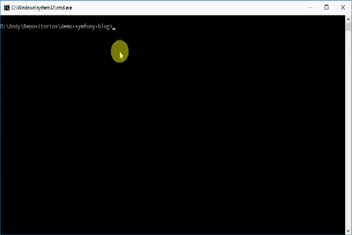

demo-symfony-blog
=================

## Requisitos:
1. PHP 7.1+
2. Mysql 5+
3. phpunit 6.0+

## Instlación

1. Clonar proyecto.
~~~
$ git clone <url>
~~~

2. Instalar dependencias composer. Requiere tener instalado composer previamente.
~~~
$ composer update
~~~

3. Instalar dependencias del frontend. Requiere tener instalado bower previamente.
~~~
$ bower install
~~~

4. Ajustar parámetros. Se debe copiar el archivo app/config/parameters.yml.dist a app/config/parameters.yml
~~~
parameters:
    database_host: 127.0.0.1
    database_port: null
    database_name: demo_symfony_blog  #Requerido
    database_user: root               #Requerido
    database_password: null
    mailer_transport: smtp
    mailer_host: 127.0.0.1
    mailer_user: andaniel05           #Requerido
    mailer_password: null
    secret: xxxxxxxxxxxxxxxxxxxxxxxxxx
~~~

5. Generar esquema de la base de datos.
~~~
$ php bin/console doctrine:schema:update --force
~~~

6. Instalar datos de prueba.
~~~
$ php bin/console doctrine:fixtures:load
~~~

7. Ejecutar aplicación.
~~~
$ php bin/console server:run
~~~

## Administración

Para acceder a la administración se deben usar las siguientes credenciales por defecto:
* usuario: admin
* password: admin

## Ejecutar tests

Para correr los tests es necesario tener instalado previamente phpunit en su versión 6.0 o superior.

~~~
$ phpunit
~~~

